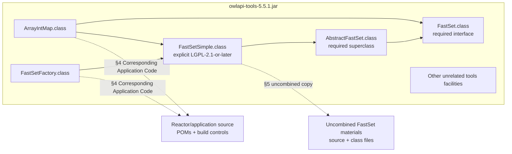

# Targeted Rights Review for the Pinned Java CI Reference

## Executive summary

This review addresses only the two unresolved rights questions identified in the attached request: the `FastSetSimple` LGPL issue in `owlapi-tools-5.5.1.jar`, and the historical OBO-format BSD-3-Clause declaration and missing named copyright notice.
The intended publication is a **public GitHub Actions test-reference artifact**, not a product dependency or release candidate, using unchanged OWLAPI 5.5.1 binaries pinned to commit `d7e997a53b470e32700de89cc610d9daf01ea769`; the owner states that corresponding component source, reactor source/POM/build material, notices and licence texts are retained. fileciteturn0file0

The principal conclusions are:

| Issue                      | Research conclusion                                                                                                                                                                                                                                                                                                                                                                                                                                                                                                                                                                                                                                                                                                                         | Recommended owner disposition                                                                                                                                                                                                                                                                                                                                                                                                                                                                                 |
| -------------------------- | ------------------------------------------------------------------------------------------------------------------------------------------------------------------------------------------------------------------------------------------------------------------------------------------------------------------------------------------------------------------------------------------------------------------------------------------------------------------------------------------------------------------------------------------------------------------------------------------------------------------------------------------------------------------------------------------------------------------------------------------- | ------------------------------------------------------------------------------------------------------------------------------------------------------------------------------------------------------------------------------------------------------------------------------------------------------------------------------------------------------------------------------------------------------------------------------------------------------------------------------------------------------------- |
| **`FastSetSimple` / LGPL** | The explicit `LGPL-2.1-or-later` file header permits choosing LGPLv3. For this packaging, **LGPLv3 §4, using §4(d)(0), is the appropriate primary compliance route**. Direct OWLAPI classes instantiate/use `FastSetSimple`; therefore §5 “Combined Libraries” cannot safely be treated as the only governing boundary merely because the covered class sits inside a JAR. The proposed three-class uncombined supplement is useful for §5 and for auditability, but is **not a substitute for the §4 requirement to provide Minimal Corresponding Source and Corresponding Application Code suitable for recombination/relinking**. fileciteturn2file0 fileciteturn12file0 fileciteturn13file0 citeturn14search0turn14search2 | **Conditional approval under LGPLv3 §4(d)(0)**. Keep native upload disabled until the actual candidate is checked for the prominent §4 notice, GPLv3+LGPLv3 texts, complete usable source/build inputs, and an explicit rebuild/recombination procedure. Do **not** clear it on §5/uncombined materials alone.                                                                                                                                                                                                |
| **OBO / BSD-3-Clause**     | The original upstream commit deliberately adds a project-level “The BSD 3-Clause License” declaration to the OBO POM, and that declaration remains in the later pre-removal snapshot. Maven's own documentation says a project's `<licenses>` entries should be licences applying directly to the project rather than its dependencies. This is strong contemporaneous evidence of upstream BSD-3-Clause licensing. The unresolved issue is **notice-holder completeness**, not identification of the licence. fileciteturn7file0 fileciteturn10file0 fileciteturn14file0 citeturn13view0                                                                                                                                       | **Approve with a recorded residual notice/provenance gap**, assuming the owner's archive inspection is accurate. Preserve the original POM declaration, full BSD-3-Clause conditions/disclaimer and every actual supplied notice; record explicitly that no component-specific named BSD copyright line was recovered; invent none. **Supplier clarification is optional rather than a necessary release blocker** unless the owner's own policy requires a named holder or stronger chain-of-title evidence. |

For `FastSetSimple`, the most important correction to the proposed reasoning is that **the physical packaging boundary is not the legal/compliance boundary**.
GNU's Java guidance expressly treats Java imports/linkage as linkage for LGPL purposes, and LGPLv3 defines an Application by its use of a Library interface and a Combined Work by combining/linking the Application and Library.
`ArrayIntMap` and `FastSetFactory`, at the pinned source, actually construct `FastSetSimple` instances.
Those relationships are stronger evidence than the fact that all classes happen to reside in `owlapi-tools-5.5.1.jar`. fileciteturn12file0 fileciteturn13file0 citeturn14search0turn14search2

For OBO, the converse principle matters: **do not infer an owner from provenance metadata**.
The 28 October 2013 commit records `hdietze@lbl.gov` and says that its purpose was to “add a license declaration to the pom (New BSD, aka BSD-3)”; that supports the licence declaration but does not establish that the committer personally owned the code, that Lawrence Berkeley National Laboratory owned it, or that the distinct LBNL BSD variant applied.
Indeed, SPDX records `BSD-3-Clause-LBNL` as a materially distinct licence with its own named Regents/LBNL wording; substituting it solely from an `lbl.gov` affiliation would manufacture terms the supplier did not supply. fileciteturn7file0 citeturn18search9

This is a source-based licence/compliance analysis, not a professional legal opinion. An accountable project rights owner still needs to decide whether the documented residual risks are acceptable and verify the **actual publication bytes**. Nothing found here creates an unconditional need for outside professional review: escalation to counsel is appropriate where the owner needs a legal opinion, where evidence differs from the facts supplied here, or where the organisation is unwilling to accept the residual scope/attribution uncertainty.

## Purpose, scope and evidence base

**Purpose and deliverables.**
The requested decision is whether the two identified components can be included in the pinned public CI reference, under what precise compliance route, what publication materials are required, and whether any residual issue should block release.
Rights are not inferred from test success, build success or a project-wide POM badge, and project approval cannot waive third-party restrictions.
Those constraints come directly from the owner's brief. fileciteturn0file0

The intended distribution matters chiefly because making a downloadable public artifact is a conveyance of copies for GNU-licence purposes; calling those copies “test-only”, “reference” or “CI” does not remove the conditions attached to conveyance.
GPLv3 defines conveying as propagation enabling another party to make or receive copies. citeturn16search0 The fact that the artifact is not a product dependency does, however, make the GPLv3 “User Product”/Installation Information scenario described later much less relevant on the stated facts. citeturn14search4

**Scope and constraints.**
I have deliberately not attempted a new rights review of the other 61/62 runtime components.
The owner states that the fixed candidate contains 63 runtime JARs, 64 source archives and 85 notice files, totalling 60,142,336 raw bytes and 33,376,893 local ZIP bytes before supplementary materials; the stated candidate manifest SHA-256 is `476aa20157ab849a3845044d3554d93a724e8adf468631ec12102a66b9b15899`.
Those figures are **owner-supplied assertions in the request**, not findings independently reproduced by this research. fileciteturn0file0

Likewise, the request identifies `java-rights-owner-proposal.md`, `java-rights-uncombined-proposal/`, `obo-original-terms-observation.json`, the fixed v3 manifest and an earlier Claude factual review as private evidence. fileciteturn0file0 In the retrievable environment for this review, only `java-rights-deep-research-request.md` was actually available.
I therefore preserve the listed private materials conceptually as evidence that should remain with the decision record, but **I have not independently inspected their contents, recomputed their hashes, or validated their file counts**.
The earlier Claude review should likewise be retained rather than discarded, but none of its unobserved conclusions is treated here as independently verified.

**Background and independently verified provenance.**
At the exact OWLAPI pin, `FastSetSimple.java` contains a 2011 copyright line naming Ignazio Palmisano, Dmitry Tsarkov and the University of Manchester and an explicit grant under GNU LGPL “either version 2.1 … or (at your option) any later version”. fileciteturn2file0 The same pinned module's `tools/pom.xml` merely inherits the OWLAPI parent and does not itself add a different licence for that source file. fileciteturn5file0 The root OWLAPI POM does list Apache 2.0 and LGPL 3.0 globally, but nothing in that declaration expressly gives this individually LGPL-marked JFact file an Apache alternative; accordingly, this report does not use the root POM as such an alternative grant. fileciteturn6file0

For OBO, the exact upstream commit `302bc7dd03a1f8e256085a3a314c96ef55cd0d9c` records an author/committer identity of `hdietze@lbl.gov`, a timestamp of 28 October 2013, a commit message specifically saying it adds the “New BSD, aka BSD-3” licence declaration, and a seven-line POM change naming “The BSD 3-Clause License”, the OSI BSD-3-Clause URL and `distribution=repo`. fileciteturn7file0 The resulting upstream POM independently confirms those fields. fileciteturn10file0 The same declaration remains in the later `ac99d288ba8ab2d66b21d2c4b73fe9d142854934` snapshot. fileciteturn14file0 The later OWLAPI OBO module says the upstream library was “slightly modified to be included directly in the OWL API”, points back to the Google Code project, and retains a BSD-3-Clause licence declaration; that is useful corroboration but is deliberately **not** being substituted for the original supplier evidence. fileciteturn15file0

**Key questions addressed** are therefore:

| Question                                                                           | Decision standard used                                                                          |
| ---------------------------------------------------------------------------------- | ----------------------------------------------------------------------------------------------- |
| May the original `LGPL-2.1-or-later` grant be exercised under LGPLv3?              | Actual file header + LGPLv2.1 §13 + LGPLv3 §6.                                                  |
| Is the JAR merely a §5 Combined Library, or does §4 Combined Work treatment arise? | LGPLv3 definitions and §§4–5, pinned class relationships, GNU Java guidance.                    |
| Do the three uncombined FastSet classes solve the issue?                           | Compare §5(a) with §4(d)(0)'s different source/relinking requirements.                          |
| What exact publication material is needed?                                         | LGPLv3 §4, GPLv3 §§1, 6 and 10, plus the pinned build/source facts.                             |
| Does the OBO POM provide meaningful original BSD evidence?                         | Exact upstream commit/POM and Maven's specification of project licence metadata.                |
| What is missing when no named BSD copyright notice was supplied?                   | Exact BSD-3-Clause conditions, SPDX treatment of variable holder text, and provenance evidence. |
| Is supplier contact mandatory?                                                     | What the licence actually requires versus what would merely reduce evidentiary uncertainty.     |

**Methodology and source hierarchy.**
I prioritised, in order: exact pinned source/commit records; the actual GNU, OSI and Maven licence/specification texts; SPDX licence/matching materials; and only then supporting project documentation. No secondary blog was used to create a compliance obligation. The principal online sources are [GNU LGPLv3](https://www.gnu.org/licenses/lgpl-3.0.html), [GNU GPLv3](https://www.gnu.org/licenses/gpl-3.0.html), [GNU LGPLv2.1](https://www.gnu.org/licenses/old-licenses/lgpl-2.1-standalone.html), [GNU's LGPL-and-Java guidance](https://www.gnu.org/licenses/lgpl-java.html), [Maven's POM reference](https://maven.apache.org/pom.html), [OSI's BSD-3-Clause text](https://opensource.org/license/bsd-3-clause), [SPDX's BSD-3-Clause entry](https://spdx.org/licenses/BSD-3-Clause), the [original OBO licensing commit](https://github.com/owlcollab/oboformat/commit/302bc7dd03a1f8e256085a3a314c96ef55cd0d9c), and the [pinned `FastSetSimple.java`](https://github.com/owlcs/owlapi/blob/d7e997a53b470e32700de89cc610d9daf01ea769/tools/src/main/java/uk/ac/manchester/cs/chainsaw/FastSetSimple.java). citeturn14search0turn14search4turn14search3turn14search2turn13view0turn13view2turn18search6

The Google Code source ZIP specified by the owner could not be fetched by the available automated web interface.
Consequently, its claimed SHA-256 `c72348109cbe998ef0f6ed24b72037168ff46b34354b217a0c6d02a5c074de2f`, byte count, 3,089-entry count and “no named OBO BSD notice” finding remain owner evidence rather than independently reproduced results. fileciteturn0file0 I could independently query the historical Git tree and verify the upstream POM, and at least one historical CSS file (`doc/wg.css`) does contain the W3C copyright notice described by the owner, illustrating why such W3C text must not be promoted into an OBO-project attribution. fileciteturn9file0 fileciteturn25file0

No monetary budget, publication deadline or required professional-opinion standard was specified.
None is invented here.

## FastSetSimple and the LGPL boundary

The strongest rights evidence for this component is not the global OWLAPI metadata but the source itself.
`FastSetSimple.java` says it is part of the JFact DL reasoner, carries the 2011 Palmisano/Tsarkov/University of Manchester copyright line, and grants LGPL 2.1 “or … any later version”. fileciteturn2file0 LGPLv2.1 §13 expressly says that where a Library specifies a numbered LGPL version “and any later version”, the recipient may follow that version or any later version published by the FSF.
LGPLv3 §6 states the same later-version option.
The proposed election of **LGPLv3 is therefore supported by the grant itself**; no new permission from the authors is needed merely to make that version choice. citeturn14search3turn14search0

That election should be documented without rewriting history.
The unchanged source should keep its original “LGPL 2.1 or later” header.
A distribution-level notice can then state, in substance, that **for this conveyance the distributor is exercising the “or later” option and complying with the component under LGPLv3**.
Replacing the original header with an assertion that the authors originally licensed the file “LGPL-3.0-only” would be inaccurate to the pinned source. fileciteturn2file0 citeturn14search0turn14search3

The central boundary question is more significant.
LGPLv3 defines an **Application** as a work using an interface supplied by the Library, and a **Combined Work** as a work produced by combining or linking that Application with the Library.
Section 4 then permits conveyance of the Combined Work under terms of choice only subject to notice, licence, modification/reverse-engineering and relinking/recombination conditions.
Section 5 is narrower: it covers placing facilities based on the Library side-by-side in a single library with “other library facilities that are not Applications and are not covered by this License”. citeturn14search0

At the pinned commit, `ArrayIntMap` declares `FastSet` values and directly executes `new FastSetSimple()` both when adding a value and when returning an empty set. fileciteturn12file0 `FastSetFactory.create()` likewise directly returns `new FastSetSimple()`. fileciteturn13file0 `FastSetSimple` itself extends `AbstractFastSet`; `AbstractFastSet` implements `FastSet`. fileciteturn2file0 fileciteturn3file0 fileciteturn4file0 These are concrete code relationships rather than mere co-location.

GNU's Java-specific guidance reinforces the conservative interpretation.
The FSF states that its main LGPL/Java conclusions remain applicable under LGPLv3 and considers Java's import/compile linkage a form of linking; the article explains that typical separate JAR packaging is a common implementation arrangement, not a rule that makes linkage disappear. citeturn14search2 GNU's broader GPL FAQ similarly describes importing/linking as mechanisms that bind sources at compilation or execution and says that modules designed to operate linked together are generally part of one combined program under its interpretation. citeturn20search2

Accordingly, the compliance boundary I recommend is:

This is an **interpretive compliance model**, not a judicial holding.
Its practical advantage is that it does not require the owner to win a narrow argument that every other class in the JAR is merely an unrelated “library facility”.
LGPLv3 §5 expressly excludes Applications from its side-by-side exception, while the pinned source provides actual callers of `FastSetSimple`.
Treating those callers as Corresponding Application Code and satisfying §4(d)(0) is therefore the materially safer route. citeturn14search0turn20search3 fileciteturn12file0 fileciteturn13file0

**Section 4(d)(1) is not the natural route.**
That option requires a suitable shared-library mechanism that uses at runtime a copy of the Library already present on the user's system and operates properly with an interface-compatible modified copy.
Here, on the facts supplied, `FastSetSimple.class` is incorporated directly into the distributed `owlapi-tools-5.5.1.jar`.
Merely saying that JARs are normally replaceable does not make an incorporated class a separate runtime library. citeturn14search0 The fact pattern therefore points to **§4(d)(0)**: convey Minimal Corresponding Source plus Corresponding Application Code in a form and under terms that let the recipient recombine/relink the Application with a modified Linked Version. citeturn14search0

The proposed three-file supplement—unchanged `FastSetSimple`, `AbstractFastSet` and `FastSet` source and class bytes outside the runtime classpath—is nevertheless sensible.
`FastSetSimple` cannot be compiled as the same class without its superclass/interface relationship; retaining all three gives the recipient an intelligible, isolated FastSet facility rather than a lone object file. fileciteturn2file0 fileciteturn3file0 fileciteturn4file0 For §5 purposes, that is a plausible implementation of the requirement to accompany a combined library with the same Library-based work in uncombined form, assuming these are indeed the complete facilities needed for the isolated work.
Section 5 does **not** say that the uncombined form must itself be on the runtime classpath. citeturn14search0turn20search3

It is not, however, enough by itself to discharge §4(d)(0).
Section 4(d)(0) asks for the material necessary to produce a **modified Combined Work**, not just a detached copy of the LGPL class.
The supplied full reactor source, module source, POMs and build controls are therefore the critical complement: they should provide the source/object code for caller/application portions and the machinery required to rebuild the Combined Work around a modified FastSet implementation. citeturn14search0turn16search0

GPLv3's definition of Corresponding Source is especially relevant.
It includes all source needed to generate, install, run and modify the object code, including scripts controlling those activities; it excludes System Libraries and general-purpose tools or generally available free programs used unmodified that are not themselves part of the work. citeturn16search0 Thus the owner does **not** need to redistribute Maven or the JDK merely because Maven and `javac` are used, assuming those are unmodified general-purpose tools.
But that exclusion should not be stretched to every third-party library input.
Any non-System-Library source/data/build input that forms part of, or is specifically needed to reproduce, the Combined Work needs to be considered on its own facts.
The stated 63-JAR/64-source-archive packaging appears designed to address that concern, but I could not inspect the candidate to confirm completeness. fileciteturn0file0 citeturn16search0

There is also **no requirement in these provisions to prove bit-for-bit reproducibility**.
The operative question is whether the supplied source and application/build material are sufficient for the recipient to modify and generate/recombine the relevant work.
A successful deterministic hash reproduction can be valuable engineering evidence, but it is neither a substitute for the licence grant nor an express condition of LGPLv3 §4(d)(0). citeturn14search0turn16search0

The exact §4 obligations for this package are therefore:

| LGPL/GPL requirement                                                          | Application to this candidate                                                                                                                                                                                                                                                                                                                                                                                                              |
| ----------------------------------------------------------------------------- | ------------------------------------------------------------------------------------------------------------------------------------------------------------------------------------------------------------------------------------------------------------------------------------------------------------------------------------------------------------------------------------------------------------------------------------------ |
| **Prominent notice with each Combined Work copy** — LGPLv3 §4(a)              | The publication must prominently say that the FastSet/JFact library material is used in `owlapi-tools-5.5.1.jar` and is LGPL-covered. A notice accompanying the JAR in the same archive can satisfy the concept of an accompanying notice if it unambiguously applies to that JAR; embedding a copy under the JAR's `META-INF` would be an especially robust implementation, but §4 does not prescribe that pathname. citeturn14search0 |
| **GPLv3 and LGPLv3 licence texts** — §4(b)                                    | Supply both. LGPLv3 expressly incorporates GPLv3 and §4(b) explicitly requires both documents. citeturn14search0                                                                                                                                                                                                                                                                                                                        |
| **Runtime notice where the Combined Work displays copyright notices** — §4(c) | Required only if the Combined Work actually displays copyright notices during execution. The facts supplied do not establish such a UI/display, so this is a **verification item**, not a reason to invent a runtime banner. citeturn14search0                                                                                                                                                                                          |
| **Minimal Corresponding Source + Corresponding Application Code** — §4(d)(0)  | Keep exact FastSet source/support source plus the caller/application source, interface/build inputs and reactor controls needed to generate a modified `owlapi-tools` Combined Work. Source-only or class-only FastSet supplements cannot replace the application/recombination side of §4(d)(0). citeturn14search0turn16search0                                                                                                       |
| **Terms permitting recombination/relinking**                                  | Do not impose package terms that stop recipients modifying the Library portion, relinking/recombining it or reverse-engineering the Combined Work for debugging those modifications. LGPLv3 §4 says this expressly; GPLv3 §10 additionally prohibits further restrictions on granted rights. citeturn14search0turn16search0                                                                                                            |
| **Network source delivery**                                                   | Because the binary is offered for download, GPLv3 §6(d)'s clean implementation is equivalent source access with the object code or clear directions to equivalent source access at no extra charge. Co-locating the source archives in the same downloadable CI package is stronger than merely pointing at an ephemeral unrelated upstream. citeturn16search0                                                                          |
| **Installation Information** — §4(e)                                          | On the stated facts, a downloadable CI archive on a general-purpose computer is not being conveyed in or specifically for use in a GPLv3 “User Product” through a transfer of that physical product. No special Installation Information obligation is apparent. Revisit only if deployment facts change. citeturn14search0turn14search4                                                                                               |
| **Original notices**                                                          | Keep the original 2011 `FastSetSimple` copyright/LGPL header intact. The distribution-level LGPLv3 election should supplement, not overwrite, that provenance. fileciteturn2file0 citeturn14search3                                                                                                                                                                                                                                  |

One remaining scope uncertainty deserves explicit treatment.
`AbstractFastSet.java` and `FastSet.java` at the pinned OWLAPI commit do **not** themselves carry the same licence header in their source text. fileciteturn3file0 fileciteturn4file0 That does not make them expendable: they are part of the concrete source relationship required to compile/understand `FastSetSimple`.
But this research has not independently established whether copyright provenance makes those two files independently part of the same originally LGPL-covered JFact work or merely support code under OWLAPI's other licensing history.
The conservative engineering answer is exactly the owner's proposed one: keep them with the uncombined materials and in the complete reactor source rather than trying to narrow the supplied source set.

There is also a `LocalFastSet` in the same package which independently implements `FastSet`; it does not appear to be required merely to compile `FastSetSimple`, and it does not directly invoke `FastSetSimple` in the pinned source I inspected. fileciteturn20file0 The complete pinned package contains `AbstractFastSet`, `ArrayIntMap`, `FastSet`, `FastSetFactory`, `FastSetSimple`, `LocalFastSet` and package metadata. fileciteturn21file0 I therefore do **not** identify `LocalFastSet` as a concrete missing fourth item from the three-file _uncombined_ supplement on present evidence.
It should, of course, remain in the full reactor source if it is part of the distributed module.

**FastSet conclusion:** the owner can use the explicit later-version option and choose LGPLv3.
The three-class supplement is worthwhile and should be retained, but the release should be documented and tested as an **LGPLv3 §4(d)(0) Combined Work compliance package**, with §5 treated as an additional side-by-side/uncombined safeguard rather than the sole theory.

## OBO BSD-3-Clause provenance and notice issue

The OBO evidence presents a fundamentally different problem: the licence identity is relatively strong; the named copyright-holder notice is weak or absent.

The original supplier history is unusually useful.
The 28 October 2013 commit is not a later OWLAPI wrapper operation: it is in `owlcollab/oboformat` itself, its message expressly says “add a license declaration to the pom (New BSD, aka BSD-3)”, and the only patch is the insertion of the POM `<licenses>` entry for “The BSD 3-Clause License” with the OSI URL and repository distribution. fileciteturn7file0 The resulting POM describes `org.bbop:oboformat`, identifies the project and its old Google Code SCM, and includes that BSD-3-Clause declaration at project level. fileciteturn10file0

Maven's official POM reference materially strengthens the interpretation of that metadata: Maven states that licences define how a project, or parts of it, may be used and that a project should list licences applying **directly to that project**, not licences applying to its dependencies. citeturn13view0turn13view1 This does not prove chain of title for every historical contribution, but it makes the upstream POM entry substantially stronger evidence than a downstream dependency scanner label or an OWLAPI parent POM badge.

The declaration also persisted through the pre-removal snapshot `ac99d288ba8ab2d66b21d2c4b73fe9d142854934`: its POM still says “The BSD 3-Clause License”. fileciteturn14file0 The later OWLAPI module continues to identify the Google Code upstream, says the code was slightly modified for inclusion in OWLAPI, and repeats BSD-3-Clause. fileciteturn15file0 I use that later material only as **corroboration of continuity**, not as a substitute grant.

The BSD-3-Clause text itself is straightforward about redistribution conditions.
OSI's canonical form allows source and binary redistribution with or without modification, subject to retention/reproduction of the copyright notice, conditions and disclaimer and the non-endorsement clause.
Its template begins with `Copyright <YEAR> <COPYRIGHT HOLDER>`. citeturn13view2turn13view3turn13view4

The owner's archive review reports that the original 60,378,497-byte/3,089-entry Google Code source archive contained the generic BSD-3-Clause POM declaration but no separately supplied named BSD copyright notice for the relevant OBO source; its named copyright hits instead belonged to W3C CSS documentation. fileciteturn0file0 I could not independently fetch the Google Code archive, so the exhaustiveness of that statement remains owner evidence.
I did independently confirm that historical `doc/wg.css` contains the W3C “1997-2003 W3C (MIT, ERCIM, Keio)” notice and its own licensing reference. fileciteturn25file0 That notice therefore belongs to the CSS material and is **not evidence that W3C is the copyright holder for the OBO Java project**.

SPDX's treatment helps identify precisely what the gap does and does not mean.
SPDX recognises `BSD-3-Clause` as a licence whose copyright-holder/year and some holder references are **replaceable text for licence-matching purposes**; its matching specification explains that different holder names should not prevent identification of the same legally substantive BSD licence. citeturn18search3turn18search6 That tells us that the lack of a particular holder string does **not** prevent identifying the legal terms as BSD-3-Clause.
It does **not** authorise a downstream redistributor to make up a holder or year.

Consequently, the correct evidentiary separation is:

| Layer                            | Finding                                                                                                                                                                                                                                                     |
| -------------------------------- | ----------------------------------------------------------------------------------------------------------------------------------------------------------------------------------------------------------------------------------------------------------- |
| **Licence identity**             | Strong evidence for BSD-3-Clause: an original upstream commit was deliberately made to add that project licence, the resulting POM says so, and it persisted in the historical project. fileciteturn7file0 fileciteturn10file0 fileciteturn14file0 |
| **Licence terms**                | Standard BSD-3-Clause: source retention, binary reproduction, non-endorsement and disclaimer. citeturn13view2turn13view3                                                                                                                                |
| **Named copyright holder**       | Not established from the supplier materials available to this review. The owner's exhaustive archive review says none was recovered for relevant project source. fileciteturn0file0                                                                      |
| **Commit provenance**            | `hdietze@lbl.gov`, 28 October 2013, made the licensing-declaration commit according to repository metadata. That is provenance, not automatically copyright ownership. fileciteturn7file0                                                                |
| **Later OWLAPI wrapper notices** | Useful corroboration that OWLAPI understood OBO as BSD-3-Clause, but they should not be substituted for whatever notice the original supplier did or did not supply. fileciteturn15file0                                                                 |
| **W3C notices**                  | Belong to W3C documentation/CSS where found, not to the OBO Java code generally. fileciteturn25file0                                                                                                                                                     |

It would be particularly unsafe to infer an LBNL ownership notice from `hdietze@lbl.gov`.
SPDX's `BSD-3-Clause-LBNL` record contains a specific Regents of the University of California/Lawrence Berkeley National Laboratory copyright declaration, mentions Department of Energy approvals and contains additional LBNL-specific terms.
It is a distinct licence record, not an attribution string that should be inserted whenever an `lbl.gov` address appears. citeturn18search9 The historical OBO POM instead deliberately pointed to standard BSD-3-Clause. fileciteturn7file0

On the facts supplied, the best publication practice is therefore to preserve **everything actually received**, without pretending to know what the supplier did not state:

> Original upstream OBO project source declared “The BSD 3-Clause License” in its project POM at supplier commit `302bc7dd03a1f8e256085a3a314c96ef55cd0d9c`.
> The supplied historical materials reviewed for this package did not contain a component-specific named BSD copyright-holder line.
> No copyright holder or year is inferred by this distributor.
> Original source notices are preserved verbatim.

That explanatory notice should accompany—not replace—the full BSD-3-Clause conditions and disclaimer and the original POM/provenance evidence.
The W3C notices should remain attached to the W3C files to which they actually belong. citeturn13view2turn13view3 fileciteturn7file0

There remains a real but narrow uncertainty.
BSD-3-Clause's source and binary conditions refer to retaining or reproducing “the above copyright notice”. citeturn13view2turn13view3 If the supplier actually gave a component-specific notice somewhere outside the evidence reviewed, omitting it would be a problem.
If, however, the historical distribution genuinely contained **no such project notice**, a downstream distributor cannot reproduce a factual notice it never received and should not invent one to make the template cosmetically complete.
The unresolved question is therefore **whether a missing original notice exists somewhere outside the recovered source history**, not whether `hdietze@lbl.gov` should simply be turned into one.

This also means that the generic BSD licence template's `<YEAR>`/`<COPYRIGHT HOLDER>` concept should not be populated with guessed information.
SPDX's “replaceable text” rule is about identifying equivalent licence text, not conferring factual knowledge of ownership. citeturn18search3turn18search6

**Is targeted supplier clarification necessary?**
On this evidence, **no—not as a mandatory precondition imposed by BSD-3-Clause itself**.
The original upstream project licence declaration is direct and deliberate; the missing element is a named notice/chain-of-title detail.
Supplier contact could reduce that residual uncertainty, but its evidential value depends on who answers and with what authority.
A historical committer saying “yes, BSD-3-Clause was intended” would corroborate scope; it would not necessarily establish ownership of every contributor's work.

If the owner chooses to seek clarification, the useful questions are narrowly framed:

1. Was BSD-3-Clause intended to apply to the OBO project source tree represented by the historical revision/archive incorporated into OWLAPI?
2. Was there any project-specific copyright notice/year/holder that downstream binary redistributors were intended to reproduce in addition to the BSD-3-Clause conditions and disclaimer?

There is no basis in the evidence reviewed to ask the individual to retroactively identify LBNL as copyright owner, to switch to `BSD-3-Clause-LBNL`, or to supply a new licence merely because downstream tooling prefers a named copyright line. fileciteturn7file0 citeturn18search9

**OBO conclusion:** if the owner's archive observation is confirmed in the final evidence record, preserving the actual upstream source/POM, full BSD-3-Clause terms, all real file-specific notices and explicit supplier provenance is a defensible publication package.
Record the absent named project notice transparently.
Supplier clarification is a **risk-reduction option**, not a rights-text requirement or an automatic release blocker.

## Publication package obligations and acceptance criteria

The candidate should be evaluated against concrete evidence, not a binary “licence scan passed” result.
A passing compile/test/rebuild proves technical properties; it does not establish a licence grant.
Conversely, absence of bit-for-bit reproducibility does not by itself defeat LGPLv3's source/recombination route. citeturn14search0turn16search0

The following is the proposed publication gate.

| Candidate material / control                                                          | Why it matters                                                                                                           | Status from evidence available here                                                                         | Required action before native upload                                                                                                                                                                                                   |
| ------------------------------------------------------------------------------------- | ------------------------------------------------------------------------------------------------------------------------ | ----------------------------------------------------------------------------------------------------------- | -------------------------------------------------------------------------------------------------------------------------------------------------------------------------------------------------------------------------------------- |
| Exact pinned `FastSetSimple.java` with original 2011 header                           | Primary grant and copyright provenance.                                                                                  | **Verified upstream.** fileciteturn2file0                                                                | Verify candidate source archive contains the same header unchanged.                                                                                                                                                                    |
| `AbstractFastSet` and `FastSet` source + class files in uncombined supplement         | Makes the proposed isolated FastSet facility coherent and supports §5/audit use.                                         | Upstream source verified; private supplement **not inspected**. fileciteturn3file0 fileciteturn4file0 | Confirm all six source/class objects exist in the published supplement and are identified as supplementary/uncombined.                                                                                                                 |
| Full reactor/module source and build controls                                         | Required to make §4(d)(0)'s recombination route meaningful.                                                              | Owner states present; **not independently verified**. fileciteturn0file0                                 | Verify root/module POMs, source trees, generated/interface inputs and required build scripts are in the candidate.                                                                                                                     |
| Corresponding Application Code for classes such as `ArrayIntMap` and `FastSetFactory` | They directly use/instantiate the LGPL facility.                                                                         | Relationship independently verified. fileciteturn12file0 fileciteturn13file0                          | Ensure their exact pinned source and any needed reproduction inputs are part of the source set.                                                                                                                                        |
| Explicit recombination procedure                                                      | Demonstrates the supplied application/source code is actually in a form suitable for producing a modified Combined Work. | A “build recipe” is asserted, but private text is inaccessible. fileciteturn0file0                       | Document: where to edit/replace FastSet material; exact reactor/module command; expected output JAR; and how that modified JAR substitutes into the test harness. Do not claim bit-for-bit reproduction.                               |
| Prominent LGPL combined-work notice                                                   | Explicit §4(a) obligation; §5(b) adds its own notice if §5 is used.                                                      | Not established from accessible package.                                                                    | Add/verify notice naming `owlapi-tools-5.5.1.jar`, the FastSet/JFact material, its original `LGPL-2.1-or-later` provenance, the distributor's LGPLv3 election and location of uncombined/source material. citeturn14search0         |
| GPLv3 + LGPLv3 texts                                                                  | §4(b).                                                                                                                   | Owner says licence texts retained; candidate not inspected.                                                 | Verify both complete official texts accompany the artifact. citeturn14search0                                                                                                                                                       |
| Reverse-engineering/recombination freedom                                             | §4's opening condition and GPLv3 §10.                                                                                    | No contrary term supplied.                                                                                  | Check the GitHub artifact, repository terms and any harness licence do not purport to prohibit modification/reverse engineering for debugging the LGPL modification or impose further restrictions. citeturn14search0turn16search0 |
| Runtime copyright notice behaviour                                                    | §4(c), but only if the work displays copyright notices while running.                                                    | Unspecified.                                                                                                | Inspect once. If no such display exists, document “not applicable”; do not invent an interactive UI. citeturn14search0                                                                                                              |
| OBO original upstream POM                                                             | Strongest direct licence provenance.                                                                                     | Independently verified. fileciteturn10file0                                                              | Preserve a copy or exact-source reference in the rights evidence package.                                                                                                                                                              |
| OBO supplier commit metadata                                                          | Shows deliberate addition of BSD-3-Clause.                                                                               | Independently verified. fileciteturn7file0                                                               | Preserve commit SHA/message/provenance as evidence.                                                                                                                                                                                    |
| Full BSD-3-Clause conditions and disclaimer                                           | Binary/source redistribution conditions.                                                                                 | Required; candidate not inspected.                                                                          | Include standard BSD-3-Clause terms. Preserve actual file notices. citeturn13view2turn13view3                                                                                                                                      |
| OBO named project copyright line                                                      | Would be reproduced if actually supplied.                                                                                | Owner says none recovered; archive unavailable to this review. fileciteturn0file0                        | **Do not invent one.** Preserve archive-search evidence and explicitly record “none recovered”.                                                                                                                                        |
| W3C notice material                                                                   | Separate third-party rights must remain attached to the appropriate files.                                               | At least one W3C notice independently confirmed. fileciteturn25file0                                     | Retain it for the actual W3C material; never use it as OBO-project attribution.                                                                                                                                                        |
| Manifest/hash/count verification                                                      | Connects the legal analysis to exact published bytes.                                                                    | Owner supplied hash/counts; private manifest inaccessible. fileciteturn0file0                            | Re-run local manifest/hash verification immediately against the publication candidate and archive the result with approval.                                                                                                            |

A practical FastSet notice could, without pretending to replace the original licence header, say approximately:

> `owlapi-tools-5.5.1.jar` contains `uk.ac.manchester.cs.chainsaw.FastSetSimple`, originally marked Copyright 2011 Ignazio Palmisano, Dmitry Tsarkov, University of Manchester and licensed under GNU LGPL version 2.1 or, at the recipient's option, any later version.
> For this distribution the later-version option is exercised under LGPLv3.
> The GNU GPLv3 and LGPLv3 texts, corresponding source, application/build source and the accompanying uncombined FastSet materials are included at [relative locations]. Recipients may modify the covered Library portions and recombine/relink the application material with a modified version as permitted by LGPLv3.

That text is a recommended engineering notice, not language mandated verbatim by the licence.
The mandatory substance comes from LGPLv3 §4(a)–(d) and, if relying on §5 for side-by-side facilities, §5(b). citeturn14search0turn20search3

A corresponding OBO provenance notice should remain deliberately narrower:

> The historical upstream OBO project declared “The BSD 3-Clause License” in its project POM at commit `302bc7dd03a1f8e256085a3a314c96ef55cd0d9c`.
> The original supplier materials reviewed for this package did not provide a component-specific named BSD copyright-holder line.
> No holder or year is inferred here.
> All actual source notices are preserved, together with the BSD-3-Clause conditions and disclaimer.

Again, that is an evidence statement rather than a replacement copyright notice.
Its function is to prevent future maintainers from “fixing” an incomplete-looking BSD record by inventing attribution.

## Risks, assumptions and research limits

The initial envelope said that the attached request content was unspecified, but the connector supplied the detailed Java rights request.
I therefore made **no assumption about the subject of the research itself**.
The following narrower assumptions remain and should be checked against the publication candidate:

| Assumption / gap                                                                                                                                                    | Consequence if false                                                                                                                                       | Treatment                                                                                                                                                                                          |
| ------------------------------------------------------------------------------------------------------------------------------------------------------------------- | ---------------------------------------------------------------------------------------------------------------------------------------------------------- | -------------------------------------------------------------------------------------------------------------------------------------------------------------------------------------------------- |
| The distributed runtime JAR really is the unchanged OWLAPI 5.5.1 artifact corresponding to the stated pinned source.                                                | Different bytes could contain different notices/code and invalidate the component-level mapping.                                                           | Re-hash/map the actual JAR against the manifest immediately before publication.                                                                                                                    |
| The owner-provided full reactor source corresponds to the distributed binary and contains the source/build controls actually needed for modification/recombination. | §4(d)(0) may be incomplete even though a source archive exists.                                                                                            | Perform a source-to-modified-JAR recombination exercise and retain the log; treat this as engineering evidence, not proof of rights.                                                               |
| No separate terms restrict modification or reverse engineering of the combined artifact.                                                                            | Such terms could conflict with LGPLv3 §4/GPLv3 §10; GPLv3 also says contradictory obligations do not excuse compliance. citeturn16search0turn16search1 | Review GitHub/package/harness terms. Project approval cannot waive a conflicting third-party term.                                                                                                 |
| The owner correctly found no project-specific OBO BSD copyright line in the complete Google Code archive.                                                           | If one exists, BSD source/binary conditions require retaining/reproducing it. citeturn13view2turn13view3                                               | Preserve the owner's search result/JSON and archive hash as evidence; optional independent rerun when archive access is available.                                                                 |
| The original OBO POM declaration was intended for the relevant project source rather than a narrower unidentified subset.                                           | Scope of the grant would become less certain.                                                                                                              | Original commit message, POM context and Maven semantics strongly support project-level scope, but do not independently prove contributor chain of title. fileciteturn7file0 citeturn13view0 |
| No separate named notice exists in non-Git/non-archive supplier material.                                                                                           | A downstream notice could be missing.                                                                                                                      | This is the residual OBO issue; record it rather than fabricating an answer.                                                                                                                       |
| This remains an ordinary downloadable software archive, not firmware/object code delivered in a locked consumer “User Product”.                                     | A changed delivery model could activate Installation Information duties.                                                                                   | Reassess LGPLv3 §4(e)/GPLv3 §6 if deployment changes. citeturn14search0turn14search4                                                                                                           |

The most significant **FastSet legal interpretation risk** is that copyright/work boundaries are not mechanically determined by Java files, Maven modules or JAR entries.
GNU's guidance itself acknowledges that questions about whether components form a single combined program ultimately involve legal judgement, even while giving its own linking criteria. citeturn20search2 That is precisely why this report recommends satisfying §4(d)(0) rather than relying on the narrower proposition that the JAR is merely a §5 Combined Library.

The most significant **FastSet evidence gap** is not the availability of the licence text—the source header settles that—but whether the inaccessible private proposal/candidate already implements every §4 detail.
In particular, I cannot certify from this session that the publication candidate contains the proposed uncombined class files, that the rights notice is prominent enough, or that the promised build recipe actually lets a recipient make a modified `owlapi-tools-5.5.1.jar`.
Those are mechanical acceptance checks rather than unanswered licence questions.

The most significant **OBO legal/evidentiary gap** is a missing named copyright-holder notice and, behind it, the usual historical-project chain-of-title question.
The upstream licence declaration is strong evidence of the licence offered by the project, but a POM does not prove the ownership/authority of every historical contributor.
The same distinction would exist even if a generic copyright line had been found.
Maven documents the meaning of the project licence field; it does not certify the licensor's title. citeturn13view0

That residual gap does **not** justify manufacturing attribution.
The commit's `lbl.gov` address does not transform into a Regents/LBNL notice, and SPDX demonstrates that the LBNL BSD variant is a separately worded instrument. fileciteturn7file0 citeturn18search9 Nor does a later OWLAPI wrapper notice retroactively become the original supplier's notice. fileciteturn15file0

The practical risk ranking is therefore:

| Risk                                                                                                                | Relative significance                 | Reason                                                                                                                                                                                      |
| ------------------------------------------------------------------------------------------------------------------- | ------------------------------------- | ------------------------------------------------------------------------------------------------------------------------------------------------------------------------------------------- |
| Publishing FastSet using **§5 alone**, without §4(d)(0) recombination material                                      | **High / avoidable**                  | Pinned code contains direct users of `FastSetSimple`; §5 expressly addresses other facilities that are not Applications. fileciteturn12file0 fileciteturn13file0 citeturn14search0 |
| Full source exists but cannot in practice be used to rebuild/recombine a modified `owlapi-tools`                    | **Material / avoidable**              | Undermines §4(d)(0)'s express suitability-for-recombination condition. citeturn14search0                                                                                                 |
| Omitting a prominent FastSet LGPL notice                                                                            | **Material / avoidable**              | Express §4(a), and §5(b) if §5 is also used. citeturn14search0                                                                                                                           |
| Choosing LGPLv3 from the existing “2.1 or later” grant                                                              | **Low**                               | Explicitly permitted by the original grant and later-version provisions. fileciteturn2file0 citeturn14search3turn14search0                                                           |
| Publishing OBO under BSD-3-Clause while transparently recording that no supplier-specific holder line was recovered | **Residual / owner-acceptance issue** | Strong original project licence declaration; uncertainty concerns notice completeness and authority, not the identified terms. fileciteturn7file0 fileciteturn10file0                 |
| Inventing an OBO holder from `hdietze@lbl.gov`                                                                      | **High / avoidable**                  | Would turn provenance into an unsupported ownership assertion and could introduce the wrong LBNL-specific terms. fileciteturn7file0 citeturn18search9                                 |
| Blocking OBO solely until the historical committer answers                                                          | **Not required by evidence reviewed** | Contact may reduce uncertainty, but nothing in the BSD text imposes a “supplier confirmation” condition. citeturn13view2turn13view3                                                     |

Automated research has an additional inherent limit: it can establish what accessible licence texts, source snapshots and repository records say; it cannot determine disputed copyright ownership, agency authority or facts outside those records.
That is not a reason to require legal counsel for every publication.
It is a reason for the accountable owner to preserve the evidence, state the residual uncertainty precisely and decide whether the organisation's risk standard accepts it.

## Milestones and recommended owner disposition

No delivery date was specified, so the appropriate timeline is a **sequence of release gates rather than invented calendar estimates**.

| Milestone                      | Required evidence / action                                                                                                                                                                                                                                                                              | Release effect                                                                                                                                       |
| ------------------------------ | ------------------------------------------------------------------------------------------------------------------------------------------------------------------------------------------------------------------------------------------------------------------------------------------------------- | ---------------------------------------------------------------------------------------------------------------------------------------------------- |
| **Evidence freeze**            | Recompute the v3 candidate manifest/hash; confirm the stated 63 runtime JARs, 64 source archives and 85 notice files; tie each reviewed conclusion to the exact file path/hash being published. Preserve the existing Claude review and owner proposals unchanged as historical evidence.               | Native upload remains disabled.                                                                                                                      |
| **FastSet compliance gate**    | Verify original FastSet header; GPLv3 + LGPLv3 texts; prominent §4 notice; three-file uncombined supplement; complete reactor/application source and build inputs; no conflicting restrictions; runtime-notice applicability.                                                                           | Clears documentary conditions for LGPLv3 §4(d)(0).                                                                                                   |
| **FastSet recombination gate** | Starting only from the supplied publication materials plus allowed general-purpose tooling, make a controlled modification to the FastSet Library material and generate a usable modified `owlapi-tools-5.5.1.jar`. Record commands, inputs and result. No bit-for-bit reproducibility claim is needed. | Demonstrates that the §4(d)(0) materials are operationally suitable; it does **not** itself prove licence rights. citeturn14search0turn16search0 |
| **OBO evidence gate**          | Preserve exact original POM/commit provenance, complete BSD-3-Clause terms, source-specific notices and the archive-search observation. Confirm the notice expressly says no component-specific holder was recovered and does not infer one.                                                            | Clears the OBO publication package subject to accepted residual provenance risk.                                                                     |
| **Accountable owner review**   | Owner records the two dispositions below, identifies accepted residual gaps and confirms that project approval is not being used to waive any third-party obligation.                                                                                                                                   | Enables publication decision.                                                                                                                        |
| **Native public upload**       | Only the evidence-frozen candidate approved above is uploaded; later byte/content changes reopen the corresponding component review.                                                                                                                                                                    | Publication may proceed.                                                                                                                             |

The **specific recommended owner disposition for `FastSetSimple`** is:

> **CONDITIONAL APPROVAL — LGPLv3 §4(d)(0).**  
> The explicit `LGPL-2.1-or-later` header authorises exercising the LGPLv3 later-version option.
> Treat `owlapi-tools-5.5.1.jar` conservatively as containing an LGPLv3 §4 Combined Work because pinned OWLAPI classes directly use/instantiate the FastSet facility. Do not rely solely on LGPLv3 §5 or on physical JAR replaceability. Retain the proposed uncombined `FastSetSimple`/`AbstractFastSet`/`FastSet` source and class files as supplementary §5/audit material, but require the complete reactor/application source and a usable §4(d)(0) recombination recipe. Public native upload is approved only after the prominent §4 notice, GPLv3/LGPLv3 texts, corresponding source/application code, recombination capability and absence of conflicting restrictions are verified against the exact candidate.
> No licensor contact is indicated merely to exercise the explicit “or later” option. fileciteturn2file0 citeturn14search0turn14search3

The **specific recommended owner disposition for OBO** is:

> **APPROVE WITH DOCUMENTED RESIDUAL NOTICE/PROVENANCE GAP.**  
> Treat the original upstream POM change at `302bc7dd03a1f8e256085a3a314c96ef55cd0d9c` as strong contemporaneous evidence that the OBO project was offered under standard BSD-3-Clause.
> Preserve that declaration, the full BSD-3-Clause conditions/disclaimer, every actual supplier notice and explicit upstream provenance. Record that the historical source/archive review found no component-specific named BSD copyright-holder notice and therefore no downstream holder/year has been inferred.
> Do not substitute an OWLAPI wrapper notice, the W3C CSS notice, `hdietze@lbl.gov`, LBNL, the Regents of the University of California or `BSD-3-Clause-LBNL` as the missing attribution.
> Supplier clarification may be sought to reduce uncertainty, but it is **not recommended as a publication blocker** unless a separate organisational policy demands a named holder or stronger chain-of-title assurance. fileciteturn7file0 fileciteturn10file0 citeturn13view0turn13view2turn18search9

Taken together, these dispositions support publication **without pretending that project approval changes third-party terms**.
The FastSet issue is principally an engineering-compliance closure problem under an identifiable LGPL route; it should remain gated until §4(d)(0) is demonstrably implemented.
The OBO issue is principally an historical attribution/provenance uncertainty around an otherwise well-evidenced BSD-3-Clause project declaration; on the supplied facts, transparent preservation of the evidence is preferable to manufacturing a copyright identity or making historical supplier contact an unconditional prerequisite.
